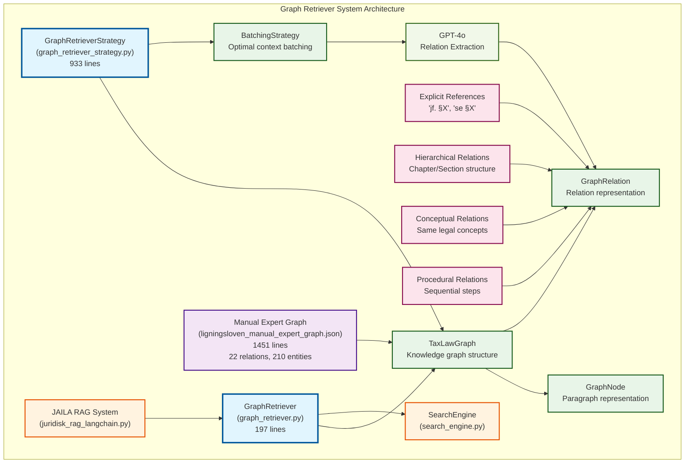

# 🏗️ Graph Retriever System Architecture

**Dato:** 7. december 2024  
**Formål:** Visualisering af Graph Retriever økosystemets arkitektur

## 🎯 System Oversigt

## 📋 Komponent Beskrivelser

### **Core Files**
- **GraphRetrieverStrategy** (933 linjer) - Hovedstrategi for graph building
- **GraphRetriever** (197 linjer) - Integration interface til JAILA

### **Data Strukturer**
- **TaxLawGraph** - Knowledge graph container
- **GraphNode** - Paragraf representation
- **GraphRelation** - Relation representation
- **BatchingStrategy** - Optimal context batching

### **Integration Points**
- **JAILA RAG System** - Hovedsystem integration
- **SearchEngine** - Semantic search integration

### **Relation Types**
1. **Explicit References** - Direkte henvisninger ("jf. §X")
2. **Hierarchical Relations** - Struktur relationer
3. **Conceptual Relations** - Begrebsmæssige forbindelser
4. **Procedural Relations** - Sekventielle processer

### **LLM Processing**
- **GPT-4o** bruges til relation extraction fra batched content
- **BatchingStrategy** optimerer context for bedre forståelse

---

*Genereret: December 7, 2024* 