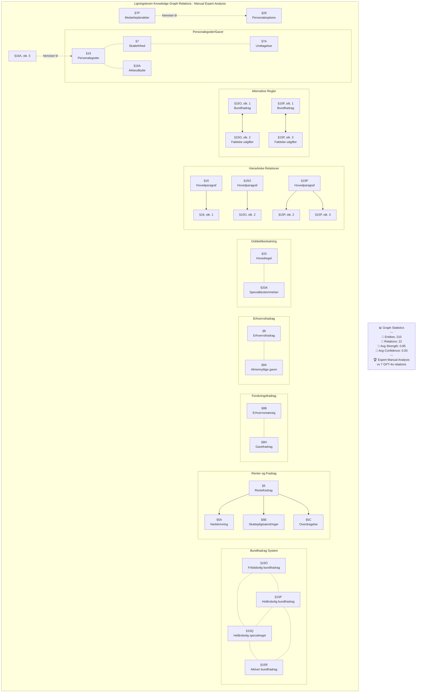

# 🔗 Ligningsloven Knowledge Graph Relations

**Dato:** 7. december 2024  
**Formål:** Visualisering af alle 22 expert-identificerede relationer

## 📊 Relations Network Diagram

## 📋 Relation Type Breakdown

### **Conceptual Relations** (12)
- Bundfradrag System: §15O ↔ §15P ↔ §15Q ↔ §15R
- Personalegoder: §7 ↔ §7A, §16 ↔ §16A, §16 ↔ §7
- Forskningsfradrag: §8B ↔ §8H
- Erhvervsfradrag: §8 ↔ §8A
- Dobbeltbeskatning: §33 ↔ §33A

### **Hierarchical Relations** (4)
- §16 → §16, stk. 1
- §15O → §15O, stk. 2
- §15P → §15P, stk. 2
- §15P → §15P, stk. 3

### **Procedural Relations** (3)
- §5 → §5A (Rentefradrag til nedskrivning)
- §5 → §5B (Rentefradrag til skattepligtsændringer)
- §5 → §5C (Rentefradrag til overdragelse)

### **Explicit References** (2)
- §16A, stk. 5 henviser til §16
- §7P henviser til §28

### **Alternative Relations** (2)
- §15O: bundfradrag ↔ faktiske udgifter
- §15P: bundfradrag ↔ faktiske udgifter

## 🏆 Quality Metrics

- **Average Strength**: 0.85
- **Average Confidence**: 0.93
- **Total Relations**: 22 (vs 7 from GPT-4o)
- **Total Entities**: 210

## ⚠️ Critical Missing Relations (in GPT-4o)

1. **Bundfradrag System** - Entire interconnected system
2. **§16 ↔ §7** - Taxable vs tax-free benefits
3. **§5 series** - Interest deduction system
4. **§8B ↔ §8H** - Research deduction types

---

*Generated: December 7, 2024* 